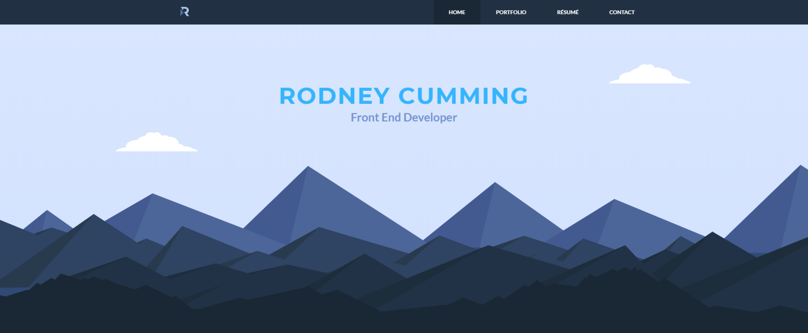

 
  
 <h1 size="+2">Parallax Portfolio</h1>
 <h4>Portfolio website using parallax scrolling on the landing page.</h4>
  

 

	
	 
	
	
	
	

 

[![NPM Version][npm-image]][npm-url]
[![Build Status][travis-image]][travis-url]
[![Downloads Stats][npm-downloads]][npm-url]

## Overview

_What does your user need to know to get everything ready after installation?_
_Think about databases, config files, and settings._

## Usage

_Give your users a sense of the workflow for using your project/tool._
_For a website this might include code for running locally._
_For an API this might include method and parameter specs._

## Live Website

www.rdny.me

## Author

- Rodney Cumming - www.rdny.me - RodneyCumming@gmail.com

## Copyright and attribution

Copyright (c) 2016 Rodney Cumming. Released under the [MIT License](https://github.com/datamade/your-repo-here/blob/master/LICENSE).

## Acknowledgments

<!-- Markdown link & img dfn's -->

[npm-image]: https://img.shields.io/npm/v/datadog-metrics.svg?style=flat-square
[npm-url]: https://npmjs.org/package/datadog-metrics
[npm-downloads]: https://img.shields.io/npm/dm/datadog-metrics.svg?style=flat-square
[travis-image]: https://img.shields.io/travis/dbader/node-datadog-metrics/master.svg?style=flat-square
[travis-url]: https://travis-ci.org/dbader/node-datadog-metrics
[wiki]: https://github.com/yourname/yourproject/wiki
